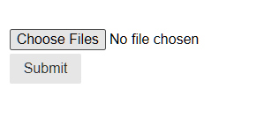

# Overview
A demo flask web app that uses Azure Blob Storage to allow users to upload and view images.

## Blob storage tutorial

A "blob" is a large binary object like a picture or video. Traditional relational databases aren't designed to store
large files and typically experience performance degradations when used to store blobs. An unsuspecting `SELECT * ...` query on a table
containing binary columns can pull gigabytes of data and bring the database to a halt.

Blob storage is designed to solve this problem. It is usually implemented as a key-value store, the key is a unique
identifier often referenced in the relational database and the value is the binary content.

In this demo, we use Azure Blob Storage to create a basic image-upload Flask app. 

### Step 1: Setting up Azure Blob Storage
In the Azure Portal, search `Storage account` and create a storage account:


Give it a name and set the location to nearest your servicing area:


Make sure to pay attention to the security settings in the `Advanced` tab. If you want to have it be a public readonly, set allow enabling anonymous access on individual containers to true. This allows you to specify the individual containers to allow anonymous access. You can specify with further granularity for if you want anonymous read, write, etc.:

  
Additionally, pay attention to your access tier. It comes in 3 options: Cool, Hot, and Cold. Cool is for data that is accessed less frequently, Hot is for data that is accessed frequently, and Cold is for data that is rarely accessed. The Hot tier is the most expensive, so if you can get by with lower tiers, it will be less expensive.


Click **Review + Create** after you are done.

Retrieve your connection string by navigating to the newly created resource and clicking on the tab on the left menu `Security + Networking` > `Access keys`.


Next, create an example blob container by clicking on the menu `Data Storage` > `Containers`. Set your container name and the access level. Private means you must have a key to access the container. Blob means you can access the blobs in the container anonymously, but you can't retrieve details about the container. Container allows anonymous access to all of the blobs, as well as anonymous retrieving of the container's properties. 


> Make sure to remember your blob connection string, account name, and container name.

### Step 2: Python setup - Install packages & configure a `.env`
Install the necessary packages using `pipenv` in your flask application:  

#### Method 1.   
Run `pipenv install azure-storage-blob` and `pipenv install flask` to install the necessary packages.   

#### Method 2. 
Add the following to your Pipfile under the `[packages]` section and run `pipenv sync`:

```
[packages]
azure-storage-blob = "*"
flask = "*"
```

Next, in your `.env` file, add:

```
FLASK_ENV=development
FLASK_APP=app.py
BLOB_CONNECTION_STRING="your-blob-connection-string"
BLOB_ACCOUNT_NAME="your-account-name"
BLOB_CONTAINER_NAME="your-container-name"
```

### Step 3: Creating a simple file upload form                  
Use this snippet to create an upload form:

```html
<form method="post" action="/upload-image" enctype="multipart/form-data" class="pure-u-1-2 pure-form pure-form-stacked">
  <fieldset style="">
    <input type="file" name="photos" multiple class="">
    <input type="submit" class="pure-button">
  </fieldset>
</form>
```

> Note: Make sure to specify `enctype="multipart/form-data"`, otherwise the form won't work.

Run your app with `flask --app app.py run --debug`. Your form will
look like this:



When the user clicks **Choose Files**, a file upload dialog will appear.

### Step 4: Create a basic blob manager utility
Create a basic blob manager python file:

```python
import os
import uuid

from azure.storage.blob import BlobServiceClient

connection_string = os.environ.get('BLOB_CONNECTION_STRING')
blob_container_name = os.environ.get('BLOB_CONTAINER_NAME')
blob_service_client = None

def setup():
  global blob_service_client, blob_container_name
  blob_service_client = BlobServiceClient.from_connection_string(connection_string)

def upload_blob(file):
  try:
    container_client = blob_service_client.get_container_client(blob_container_name)

    key = "your-unique-key"
    
    container_client.upload_blob(key, file)
    blob_url = f"https://{blob_service_client.account_name}.blob.core.windows.net/{blob_container_name}/{key}"
    return blob_url
  except Exception as e:
    print(e)
    return None
```

Don't forget to call the setup function in your `app.py`:

```python
app = Flask(__name__)
with app.app_context():
  blob_manager.setup()

```

### Step 5: Receiving the uploaded file in Flask & storing in Azure Blob Storage

Define a `POST` route handler for `/upload-image` in your `app.py` (View our completed `app.py` [here](app.py)):

```python
from . import blob_manager

@app.route("/upload-image", methods=['POST'])
def upload_image():
  """ stores the uploaded image(s) in blob storage"""
    for file in request.files.getlist("photos"):
        blob_manager.upload_blob(file)
      
    return "File uploaded successfully"
```

### Step 6: Listing stored blobs & rendering to a gallery
To retrieve stored files, add a `list_blobs` function to your blob manager utility:

```python
def list_blobs():
  global blob_service_client

  container_client = blob_service_client.get_container_client(blob_container_name)
  blobs = container_client.list_blobs()
  blob_urls = []
  for blob in blobs:
    blob_urls.append(
      f"https://{blob_service_client.account_name}.blob.core.windows.net/{blob_container_name}/{blob.name}")
  return blob_urls # returns a list of image urls
```

Then, in your `app.py`, add a route that retrieves these blobs:
```python
@app.route("/uploads_view")
def uploads_view():
  """ Fetch all blob URLS and display all uploaded files"""
    blobs = blob_manager.list_blobs()

    return render_template("uploads_view.html", blobs=blobs)
```

Here, `blobs` is just a list of image URLs, so we can easily render them with a Jinja template in `uploads_view.html`:
```html
<div>
  
    
  
</div>
```
### Finished
You are now able to upload images and view them in the gallery.
